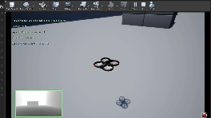

# RL_Final_Project
RBE 595 RL Project - Quadrotor on Airsim with RL and Vision

## Sample Output

## Current Motion Primitives - Base

Currently, we are following motion primitives as below as suggested in class

- forward movement at the current altitude
- 45 degree left at the current altitude 
- 45 degree right at the current altitude 
- forward and up
- 45 degree right and up
- 45 degree left and up
- forward and down
- 45 degree right and down
- 45 degree left and down 

## Code Structure and Explanation

1. The code is a modified form of original Airsim implementation.
2. Changes are done to airsim_env.py to handle Multi Input dictionaries (Image + Combination of Vectors)
3. Changes are also done to drone_env.py to handle custom reward function and other minor setup commands or changes.
4. Major changes are done to dqn_drone.py to handle Custom Callbacks for Tensorboard and Handle new architecture which is implemented in custom_policy_sb.py

Overall the above changes can be replicated in your environment by placing the respective files in the respective folders which is exactly the same format mentioned below:
    
        Replace airgym/envs here with your Local Airsim Repository
        Replace dqn_drone.py present here with your Local Airsim Copy.

To run the code

    Start Unreal and Use the Project mentioned in this Repo (Blocks)
    We customised this environment to have three different arenas for experimentation purposes. The environments currently have this configuration
        1. Arena with No Obstacle
        2. Arena with Two Obstacles
        3. Arena with multiple obstacles

Execute the code:

    python3 dqn_drone.py

